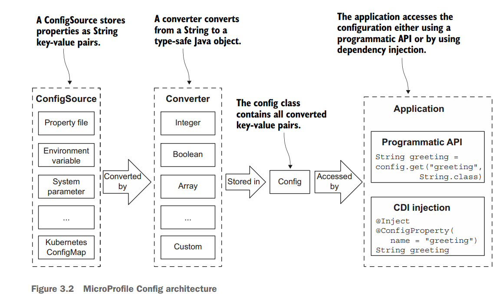
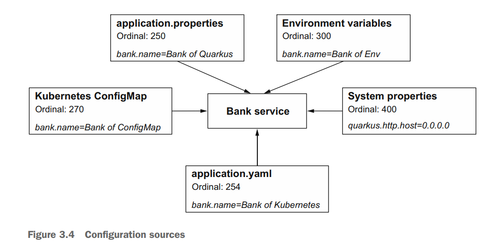
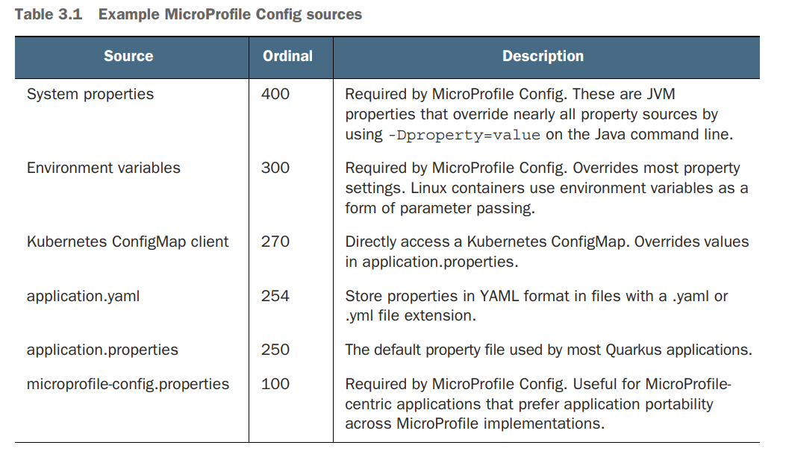

# Quarkus configuration



## ConfigSources

Each configuration source is assigned an _ordinal_. The properties defined in a configuration source with a higher ordinal take precedence over properties defined in a configuration source with a
lower ordinal





For environmen variables configuration, Quarkus applies the following rules

1. Exact match—Search for bank.mobileBanking. If not found, move to the next rule.
1. Replace each nonalphanumeric with _—Search for bank_mobileBanking. If not found, move to the next rule.
1. Replace each nonalphanumeric with _ ; convert to uppercase—Search for BANK_MOBILEBANKING

Therefore, if we define an env var

```export BANK_NAME="Bank of Env"```

that one will be used because of the higher ordinal compared to the properties file value.

**UNITL 3.6 Grouping properties with @ConfigPropertie**


## Add ConfigMap and Secret support for Quarkus

```xml
<dependency>
    <groupId>io.quarkus</groupId>
    <artifactId>quarkus-kubernetes-config</artifactId>
</dependency>
```

