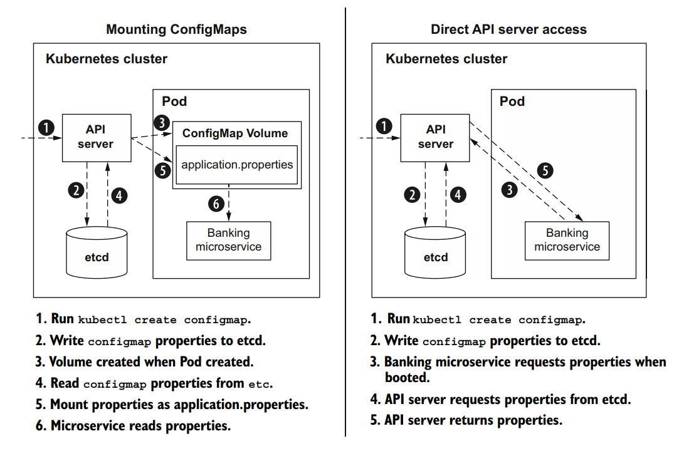

# Quarkus configuration


## ConfigSources

Each configuration source is assigned an _ordinal_. The properties defined in a configuration source with a higher ordinal take precedence over properties defined in a configuration source with a
lower ordinal


For environmen variables configuration, Quarkus applies the following rules

1. Exact match—Search for bank.mobileBanking. If not found, move to the next rule.
1. Replace each nonalphanumeric with _—Search for bank_mobileBanking. If not found, move to the next rule.
1. Replace each nonalphanumeric with _ ; convert to uppercase—Search for BANK_MOBILEBANKING

Therefore, if we define an env var

```export BANK_NAME="Bank of Env"```

that one will be used because of the higher ordinal compared to the properties file value.

**UNITL 3.6 Grouping properties with @ConfigPropertie**

## Run-time vs. build-time properties
In a traditional Java runtime configuration is resolved at runtime, using a **classpath scan** which requires more ram and cpu resources.

Qaurkus optimizes code with scan at compile time: all the code and the configuration is created at compile in a **metamodel**, so that memory occupation of the artifact and its boot time will be reduced.
Build-time properties influence compilation and how the metamodel (like annotation processing) is prewired.
Therefore, if we change at runtime a build time configuration value for a Quarkus application, this will not be read by the application because that value has been already precompiled.

This because Quarkus is oriented to containerized runtime (Kubernetes) where pods are supposed to be immutable and ephemeral.

Quarkus accept also run time configuration for those values that are typically known at run time only: on example is the jdbc url, while the jdbc driver is blocked at compile time (it is known what driver we want to use in our application)

Each Quarku extensions comes with the list of compile time and run time configuration: [All guide configuration](https://quarkus.io/guides/all-config)

## Configuration on Kubernetes

There are several modes to configure a Quarkus application running on Kubernetes:

* _system properties_: parameters passes to the java run command (```-Djava.util.loggin.manager=...```)
* _environment variable_: since the pod runs a self contained application with the operative system, it is possible to set environment variables active only for the running application (```POSTGRES_USER```)
* _ConfigMaps_: 
The common approach to attach a _ConfigMap_ to an application is to mount it as a volume accessible to all containers in the pod (in Tekton as key=filename, value=filecontent)
The Quarkus extension uses the approach of **directly accessing** the configuration in the _etcd_ database using the Kuberneted API.

* _application.properties_: this can still be used in the containerized Quarkus application
* _third party configuration sources_: supported are Spring Cloud Config Server, Vault, and Consul

## Add ConfigMap support for Quarkus

```xml
<dependency>
    <groupId>io.quarkus</groupId>
    <artifactId>quarkus-kubernetes-config</artifactId>
</dependency>
```

A _ConfigMap_ with name **banking** can be generated with in the cluster with:

```yaml
kubectl create configmap banking --from-file=application.yaml
```

It will contain the key _application.yaml_ which will have priority over the ones on application.properties

Now the ```application.properties``` files has to be changed with

````properties
%prod.quarkus.kubernetes-config.enabled=true
#comma separated list of cm names to be scanned
%prod.quarkus.kubernetes-config.config-maps=banking
````

## Add Secret support for Quarkus

Create a secret

```shell
kubectl create secret generic db-credentials --from-literal=username=admin --from-literal=password=secret --from-literal=db.username=quarkus_banking --from-literal=db.password=quarkus_banking 
```

Add properties for secrets in ```application.properties``` (note the name of the secret)

```properties
%prod.quarkus.kubernetes-config.secrets.enabled=true
%prod.quarkus.kubernetes-config.secrets=db-credentials
```

